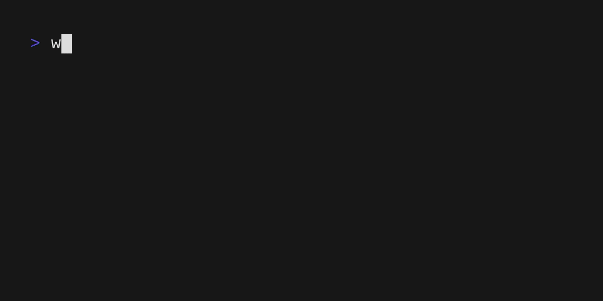

# Fleek - "Home as Code" for Humans

Fleek is an all-in-one management system for everything you need to be productive on your computer.

Status: ALPHA.  Probably won't eat your computer. Probably won't break your system, at least beyond simple recoverability.

## Own your $HOME

### Instant Productivity

Fleek takes you from an empty slate to a fully productive working environment in less than five minutes.

### Take It With You

No matter whether you work on a shiny new M2 MacBook Air, a well-loved ThinkPad running Linux, or Windows with WSL, Fleek lets you take the exact same environment, tools, and configuration wherever you go.

### Zero Learning Curve To Start

You don't need to master a fancy DSL or spelunk through pages of online manuals to get started with Fleek. Answer two questions and you're instantly off to the races. Fleek gives you opinionated starter configurations for `bash` and `zsh` in four different levels of BLING. You can choose a standard close-to-stock experience, or dial your environment to 11 with all the latest desktop and terminal bling. And switching between them takes less than a minute when you change your mind.

### Every Tool At Your Fingertips

Whether you need to install a new programming language's toolset or the latest social media application, Fleek has you covered with the largest set of programs and packages in the world. Add a line to your `.fleek.yml` file and `fleek apply` yourself into freedom.

### Eject Button Optional

If you reach a point where you've grown beyond Fleek's opinions and you want more, just `fleek eject` and manage your configurations manually.

## Party in the Front, Business in the Back

Fleek is a user-friendly wrapper around Nix and Nix Home Manager, but the friendly `fleek` command hides all the complexity from you. Edit a 10 line YAML file and Fleek harnesses the power of Nix behind the scenes.

## Getting Started

You need `nix`. We love the [Determinate Systems Installer](https://zero-to-nix.com/), but any `nix` is good. If you're on Fedora Silverblue [this script](https://github.com/dnkmmr69420/nix-with-selinux/blob/main/silverblue-installer.sh) is the good stuff.

After Nix is installed you need to enable [flakes and the nix command](https://nixos.wiki/wiki/Flakes). It can be as simple as this:

```shell
mkdir -p ~/.config/nix
echo "experimental-features = nix-command flakes" >> ~/.config/nix/nix.conf
```

Next you'll need `fleek`. Download from the releases link and move it somewhere in your $PATH.

Finally, run `fleek init`. This will create your configuration file and symlink it to `$HOME/.fleek.yml`. Open it with your favorite editor and take a look.


Here's what mine looks like:

```file
───────┬───────────────────────────────────────────────────
       │ File: .fleek.yml
───────┼───────────────────────────────────────────────────
   1   │ aliases:
   3   │     cdfleek: cd ~/projects/ublue/fleek
   4   │     fleeks: cd ~/.config/home-manager
   5   │     projects: cd ~/projects
   7   │ bling: high
   8   │ ejected: false
   9   │ flakedir: .config/home-manager
  10   │ name: Brians Fleek Configuration
  11   │ packages:
  12   │     - go
  13   │     - gcc
  14   │     - nodejs
  15   │     - yarn
  16   │     - rustup
  17   │     - vhs
  18   │ paths:
  19   │     - $HOME/bin
  20   │     - $HOME/.local/bin
  21   │ programs:
  22   │     - dircolors
  23   │ repo: git@github.com:bketelsen/fleeks
  24   │ shell: zsh
  25   │ systems:
  26   │     - arch: x86_64
  27   │       git:
  28   │         email: bketelsen@gmail.com
  29   │         name: Brian Ketelsen
  30   │       hostname: ghanima
  31   │       os: linux
  32   │       username: bjk
  47   │     - arch: aarch64
  48   │       git:
  49   │         email: Brian Ketelsen
  50   │         name: bketelsen@gmail.com
  51   │       hostname: chapterhouse
  52   │       os: darwin
  53   │       username: bjk
  68   │ unfree: true
───────┴──────────────────────────────────────────
```

I removed some of the aliases and systems just to make the example shorter, that's why the line numbering isn't sequential.

Line 7: `bling: high` tells `fleek` that I want lots of extras in my $HOME setup. If you don't have a strong opinion I recommend `high`, it isn't a lot of extra stuff and the set we chose to add is really strong. Options are `none`, `low`, `default`, `high`.

Line 11: `packages:` starts a list of the packages I want installed. Mine are mostly focused around software development, but any package available in [nixpkgs](https://search.nixos.org/packages) is available.

Line 18: `paths:` starts a list of directories I want to add to my $PATH.

Line 24: `shell: zsh` tells fleek which shell I use so it can write the proper configurations.

Line 25: `systems:` These are added by `fleek` when you run `fleek init`, you shouldn't need to edit this part manually. Note that `fleek` and `nix` support macOS, Linux and more, so your configurations are fully portable.

Now that you've seen some of the possibile changes you can make, edit your `~/.fleek.yml` file and save it.

To apply your changes run `fleek apply`. `fleek` spins for a bit, and makes all the changes you requested. You may need to close and re-open your terminal application to see some of the changes, particularly if you add or remove fonts.



That's the quick start! From here, you can try `fleek add` to add packages from the CLI, `fleek search` to search for available packages, and explore `fleek remote` to share the same `fleek` configurations with multiple computers.

### Behind the Scenes

Fancy animated gifs and long-winded README's are great, but what really happens when you run `fleek apply` the first time? I'm glad you asked...

1. `fleek` creates a [nix home-manager][def] configuration based on the [templates here](https://github.com/ublue-os/fleek/blob/main/internal/nix/home.nix.tmpl).
1. `fleek` compiles the templates and writes them to disk at `~/.config/home-manager` by default.
1. `fleek` calls the `nix` command, which does `nix` things to download and install all the packages in your `.fleek.yml` file.
1. The libraries and binaries you specify get installed in the `/nix` folder, and symlinked into your very own personal `nix` profile. This is stored in your $HOME directory under `~/.nix-profile`.
1. The `home-manager` command in the configuration assembles shell scripts and configurations for you based on the shell specified in your `.fleek.yml` file.
1. Your existing shell configuration files get renamed with a `.bak` extension, so you can go back to your business if `fleek` isn't for you.
1. New configurations are written, either `.zshrc` or `.bashrc`, and these configuration files add your `~/.nix-profile` and the packages you've installed to your $PATH

Fleek's goal is to give you 90% of the power of a fully customized, hand-written, artisinally crafted `home-manager` configuration -- without forcing you to learn `nix`, which can be (ok, it IS) intimidating.

You may like `fleek` and use it on one or more of your machines to install the things you need and use every day.

You might eventually be curious about how it all works. If that's the case you can always look at the nix flake that's generated for you and see what's going on behind the scenes. Cool! There's a lot you can do with `nix` that `fleek` doesn't even attempt.

Or you might be a practical pragmatist sort of computer user and not care about what's happening behind the curtain. That's fine with `fleek`. We're just here to help you go from zero to productive faster, more reliably, without a bunch of fuss.

## Motivation

`fleek` is born out of frustration.

It's annoying setting up a new computer just right. It's annoying having completely different configurations and tools each place I need to work. It's nearly impossible to configure a Mac and an Ubuntu server to have the same look & feel, much less the same tools.

It's a huge time sink spending time configuring everything, and even worse when you try to do it in a way you can share it between computers.

It wasn't until I was talking with Jorge Castro and he pointed out how complex my `home-manager` config was compared to a simple YAML file.


Jorge is a smart dude. That night the first bits of `fleek` were written.

Within 24 hours I took the plunge and dog-fooded `fleek` on my development laptop. That was a great moment. A day later I added `fleek remote` commands to push my configs to GitHub, then added the code to detect your arch & os and change the flake accordingly.

I spent the next two weeks tweaking the user experience and testing over and over. Countless virtual machines were provisioned and destroyed.

| *countless*

And now we're here. `fleek` is ready for a broader audience than me and Jorge - who is the biggest inspriation for all the features `fleek` has, and maybe just as importantly, doesn't have.

## Shoulders

Standing on the shoulders of giants:

This flake template was the thing that got everything started!

- [flake template](https://github.com/Misterio77/nix-starter-configs)
- [template license](https://github.com/Misterio77/nix-starter-configs/blob/main/LICENSE)

In my third rewrite, I looked at devbox and loved how they organized everything. I *borrowed* a LOT from this. And by *borrowed* I mean outright copy & pasted. Many supporting functions in this code were written by the JetPack team, and very lightly modified by me.

- [devbox](https://github.com/jetpack-io/devbox)
- [devbox license](https://github.com/jetpack-io/devbox/blob/main/LICENSE)

Great terminal display code inspired by and copied from pcli.

- [pcli](https://github.com/pterm/pcli/)
- [pcli license](https://github.com/pterm/pcli/blob/main/LICENSE)

None of this is possible without Nix and Nix Home Manager:

- [nix](https://nixos.org/)
- [home manager][def]

[def]: https://github.com/nix-community/home-manager
